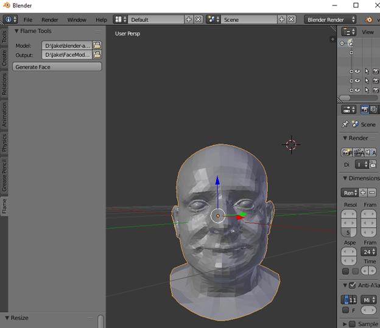
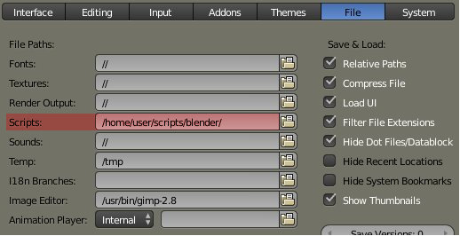
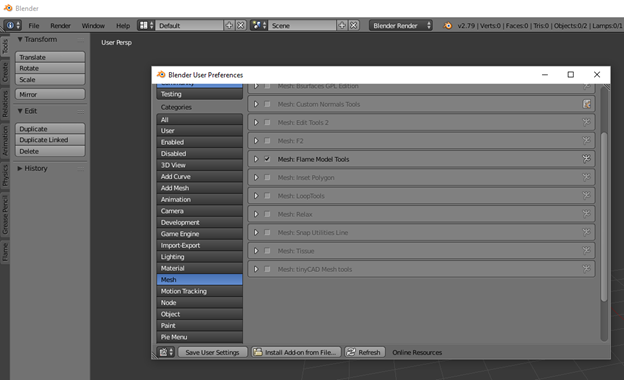

# Blender FLAME Addon
This blender add-on for is for tools using the FLAME Face model [\[1\]](#references). Currently, a Python 3.x fork of the [flame-fitting](https://github.com/spacejake/flame-fitting) code is used as a library for accessing the pre-trained model. The pretrained model is available for research purposes after registering at the [FLAME project](http://flame.is.tue.mpg.de) page.
  
This add-on is also incomplete and initially just a starting point to use Blender as a visualization tool for the Flame model. We will be adding tools as we work.



# Blender Setup
The Blender python distribution will need some dependancies installed. We will install these using PyPi and PIP. We only provide instructions for windows.
  
__Install PIP:__  
* Download pip installation script
``` bash
wget https://bootstrap.pypa.io/get-pip.py
```
* Run get-pip.py with Blender's Python
``` bash
# Path to Blender Installation
"C:\Program Files\Blender Foundation\Blender\2.79\python\bin\python" D:\Jake\blender-addons\get-pip.py
```
  
__Install Dependancies:__  
The dependancies will be similar to those found in the [flame-fitting](https://github.com/spacejake/flame-fitting/tree/python3) repo in the python3 branch. We will use Blender python's newly installed PIP to install these.
* numpy
* scipy
* chumpy
* OpenCV
  
First Install numpy and scipy normally
``` bash
# Path to Blender Installation + Path to PIP
"C:\Program Files\Blender Foundation\Blender\2.79\python\bin\python.exe" "C:\Program Files\Blender Foundation\Blender\2.79\python\Scripts\pip3.exe" install numpy scipy
```
  
Next install a python3 compatible [chumpy](https://github.com/homier/chumpy), as instructed for the [flame-fitting](https://github.com/spacejake/flame-fitting/tree/python3) repo.
``` bash
git clone https://github.com/homier/chumpy.git
cd /path/to/py3_chumpy
git checkout py3
"C:\Program Files\Blender Foundation\Blender\2.79\python\bin\python.exe" "C:\Program Files\Blender Foundation\Blender\2.79\python\Scripts\pip3.exe" install .
```
  
Lastly, install opencv for python. 
* Download a pre-build wheel for python OpenCV 
  * We used [opencv_python-3.4.0-cp35-cp35m-win_amd64.whl](http://www.lfd.uci.edu/~gohlke/pythonlibs/#opencv)
* Install using Pip
``` bash
"C:\Program Files\Blender Foundation\Blender\2.79\python\bin\python.exe" "C:\Program Files\Blender Foundation\Blender\2.79\python\Scripts\pip3.exe" install opencv_python-3.4.0-cp35-cp35m-win_amd64.whl
```

# Installing Flame add-on
The issue is resolving the [flame-fitting](https://github.com/spacejake/flame-fitting) module. Blender has a folder where you can put module dependencies, aptly named modules. This is where to put the flame resource, but must first put `__init__.py` in the root dir of the flame module so python can read the it as a whole lib. This will prevent needing to sys.path.append() to access the module. You also have to rename the directory name `flame-fitting` to `flame_fitting`.
  
You can use the scripts directory in the Blender install the add-on. 
* Put the Blander FLAME addon dir (mesh_flame) where the `addons`. 
* Put the [flame-fitting](https://github.com/spacejake/flame-fitting) module in the `modules` dir. 
  
However, blender provides the option of using an external scripts dir. I prefer this, as I like to work outside of the application’s install dir.
  

  
In order to use an external scripts dir:
* Ext. scripts Directory must contain 3 sub-directories : `addons`, `modules`, and `startup`.
* Go to User Preferences, tab File, and specify a custom extra folder for scripts, in the scripts input location of the external scripts dir.
  
Further, I also like to use symlinks, so I created one to the repo's module mesh-flame.
``` bash
mklink /d "D:\Jake\blender-addons\addons\mesh_flame" "D:\Jake\blender-addons\dev\blender-flame-addon\mesh_flame"
```

Add the mesh_flame addon normally in Blender



# References
1. Tianye Li*, Timo Bolkart*, Michael J. Black, Hao Li, and Javier Romero, Learning a model of facial shape and expression from 4D scans, ACM Transactions on Graphics (Proc. SIGGRAPH Asia) 2017
